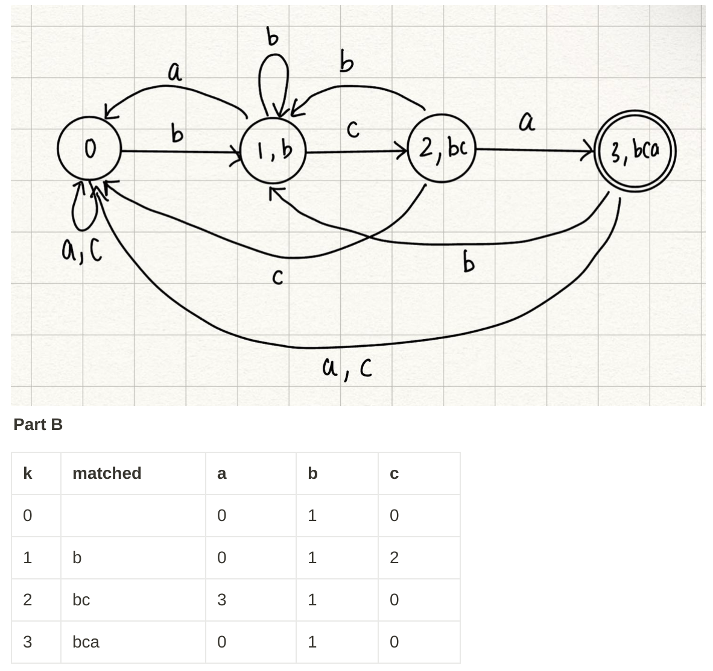
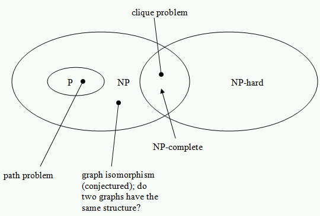

<!-- SPDX-License-Identifier: zlib-acknowledgement -->
<!-- https://courageous-postbox-384.notion.site/COMP3121-Tutorials-7490cbbb823044fcac4453661746ab42 -->
<!-- have some character mark for markdown newline ending with two or more spaces -->

**Algorithm** -> **Terminates** -> **Correctness** -> **Time Complexity**  

`f(n)=O(g(n))`, if `f(n)/g(n) <= C` or `lim∞ f'(n)/g'(n)=0`  
`f(n)=o(g(n))`, if `f(n)/g(n) > C` or `lim∞ f'(n)/g'(n)=∞`  
`f(n)=t(g(n))`, if `o(n)=t(n)` or `lim∞ f'(n)/g'(n)=0`  

`logb(xy)=logb(x)+logb(y)`  
`logb(x/y)=logb(x)-logb(y)`  
`logb(x^n)=nlogb(x)`  
`logb(x)=loga(x)/loga(b)`  
`logb(1)=0`  
`logb(b)=1`  
`b^(logb(x))=x`   
`a^n = a^n * ln(a)`  
`ln(x) = 1/x`  
`arithmetic-sum = (n/2)*(2a + (n-1)d)`  
`geometric-sum = (a*(1-r^n))/(1-r)`  

**Topological** (vertices connected left to right): `O(|V|+|E|)`  
**Djisktra** (positive shortest path to all vertices): `O(|V^2|)`  
**Bellman-Ford** (negative-non-cycles shortest path to all vertices): `O(|V||E|)`  
**Floyd-Warshall** (negative-non-cycles shortest path for all pairs of vertices): `O(|V|^3)`  
**Prims/Kruskal** (minimum spanning tree): `O(|V^2|)`  
**BFS** (find all vertices accessible): `O(|V|+|E|)`   
**Heap** `O(logn)`  
**SelfBalancingTree** `O(logn)`  
**EdmondsKarp** `O(|E||f|)`, `O(|V||E^2|)`   
**Bipartite-Graph** (vertices in disjoint sets with edges connecting only to other set)  
\    
\    
\    
\    
\  

**DIVIDE AND CONQUER**  
`T(n) = a·T(n/b) + f(n)`, *a = num-subproblems*, *b = size-subproblems*  
critical: `n^(logba)`  
`f(n) <, t(n^(logba))`  
`f(n) =, t(n^(logba)·log2n)`   
`f(n) > and a·f(n/b) <= c·f(n), t(f(n))`  
**Binary-Search**  
If possible for n, possible larger values; monotonicity. Also have upper/lower bound  
**Algorithm**  
1. Recursively divide into two subarrays of approximately equal parts. Find distinct cards in the first `k/2` and last `k/2`.  
2. Merge the results of 2 subarrays by checking through each card one by one in both halves to get a subarray with distinct cards.  
3. Base case: for `n=1` students, a single collection contains distinct cards  
**Induction**  
For base case of `n=1`, we know a single collection has distinct cards.   
Assume this works for `n=k`.   
For `n=k+1`, by problem definition, merging two collections will always produce a collection of distinct cards.   
So, merging two collections of `n=k` will produce a distinct collection at `n=k+1`.  

**GREEDY**  
**Stays-Ahead**  
1. Let greedy solution be `G=(g1, g2, g3, ..., gn)` where `gi` represents a particular rod.   
   Let an alternative supposed optimal solution be `O=(o1, o2, o3, ..., on)`  
2. Base case is welding the 2 shortest rods.  
   Welding `g1 + g2` will yield the absolute shortest welded rod of absolute minimal cost of any 2 rods.   
   Therefore, welding `g1 + g2` costs no more than welding `o1 + o2`  
3. Assume that welding rods up to `gk−1` costs no more than welding rods up to `ok−1`    
4. As the cost of the resultant rod from `gk−1` welds is no more than `ok−1`, `gk−1 + gk` cannot cost any  
more than `ok−1 + ok`. As a result, since O is arbitrary, G must be optimal  
*ALTERNATE: If these rods were not present at this location in O, then they must appear closer to the centre of O.*  
**Exchange**  
1. Let x be the activity that starts last overall  
2. Consider an alternative schedule S that doesn't contain x   
3. Let y be that activity in S that starts last   
4. Since we know x is activity that starts last, x must start after y. y won't clash, meaning x won't clash  
5. Therefore, can iteratively transform S into a new schedule S' that contains the activity that starts last  
**Contradiction**  
* Since deleting vertices from G, must first arrive at a graph containing H as a subgraph, i.e. must arrive at H' before H.  
* Suppose alternative solution that deletes a smaller set of vertices `D=(v0, v1, ...)` at this point than our solution.   
  Therefore, there must exist at least one vertex vi in our solution not in D. For vi to not have been deleted, it  
  must not be adjacent to at least k vertices.   

**FLOW**  
Create a flow network with:  
– Source vertex S and sink vertex T  
– n children vertices R  
– For each child i, an edge `(S, R)` with capacity 1  
**Correctness**  
For particular edge, flow conservation ensures that cannot recieve more ...  
For particular vertex, capacity constraint ensures cannot hold more ...  
Maximum flow is constrained by the total number of children, i.e. `|f| = n`  

**DYNAMIC PROGRAMMING**  
**Subproblem:**  
Let `min(i, a)` be minimum time taken to travel to city `ci` arriving on animal `a`.  
Let `animal(i)` be the animal that was used to arrive at city `ci` on a journey of minimal time.  
**Recurrences:**  
`min(i, a) = minimum{min(i − 1, a1) + d(i)/v(a), if R(i − 1, a1, a)}`  
`animal(i) = argmin{min(i,a)}` *a -> G,M,A,I,L*  
**Base Case:**   
**Order:**  
Initialise 2D table `min[n][5]` bottom-up with an outer loop from `i = 1..n` and inner loop `j = 1..5`  
Set all entries to ∞ to handle cases where no animal can arrive at a particular city.  
To obtain list of animals, backtrack from `i = n..1`  
**Final Solution:**  
Minimal Amount of Time: `minimum{min(n, a)}`  
**Proof:**  
1. Base case  
2. Assume that optimal determined by the optimal choice of between consecutive cities `ck` and `ck+1`.  
Suppose an alternative optimal solution is where the choice between consecutive cities is not optimal.   
In this case, the total travel time could be reduced by changing the animals between these cities.   
For example, if this solution has animals `a1, a2` there exists animals `a3, a4` such that smaller.  
This contradicts assumption that this alternative solution is optimal.   
Therefore, optimal solution is built up from optimal solutions to its subproblems.  
3. Explaining recurrence, considering minimum of all allowable combinations between `ci−1, ci` the optimal choice for `ci−1, ci` will be made.    

**STRINGS**  
**Rabin-Karp O(n), O(mn)**  
*'m' as could have false positive at every point with 'm' comparisons to verify*  
1. alphabet `{"a": 0, "b": 1, "c": 2}` compute all particular length substrings `"abc" = 012`  
2. with example prime of 5, compute horner's rule hash `0121 % 5 = 5`  
3. compare polynomial rolling hash with horner hash and traverse if equal  
**Knuth-Morris-Pratt O(n+m)**  
"abccbbcabc", substring "bca"  

**LINEAR**  
maximise `P = 5x1 + 3x2 + 4x3`  
: `x1 + 2x2 + x3 <= 6`  
: `3x1 + x2 + x3 <= 4`  
*possible sign reversal from -1 multiplication to get <= maximise standard form*
minimise `P* = 6y1 + 4y2`  
: `y1 + 3y2 >= 5`  
: `2y1 + y2 >= 3`  
: `y1 + y2 >= 4`   
unconstrained `x -> R`; `x = x' - x''`  

**INTRACTABILITY**  

Polynomial-time reduction is one-way  
NP-Hard at least as difficult as NP, with no known polynomial time solution.
