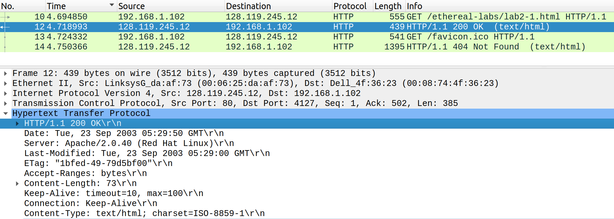
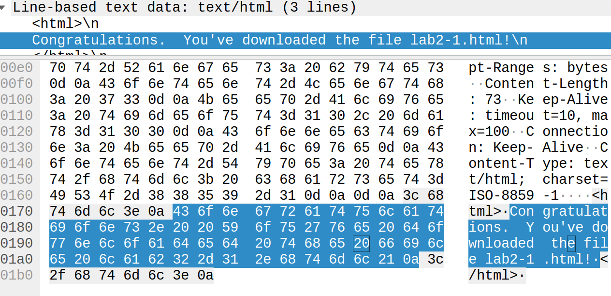
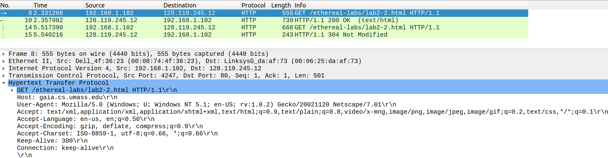
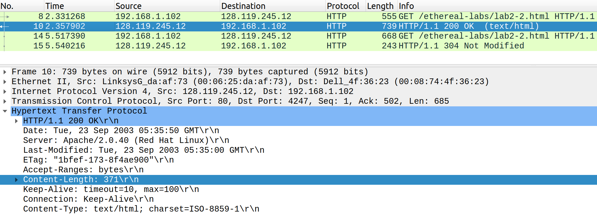
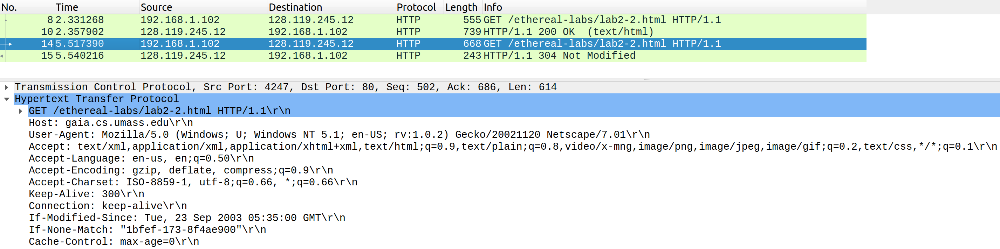
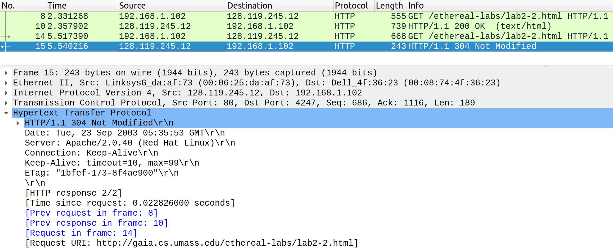
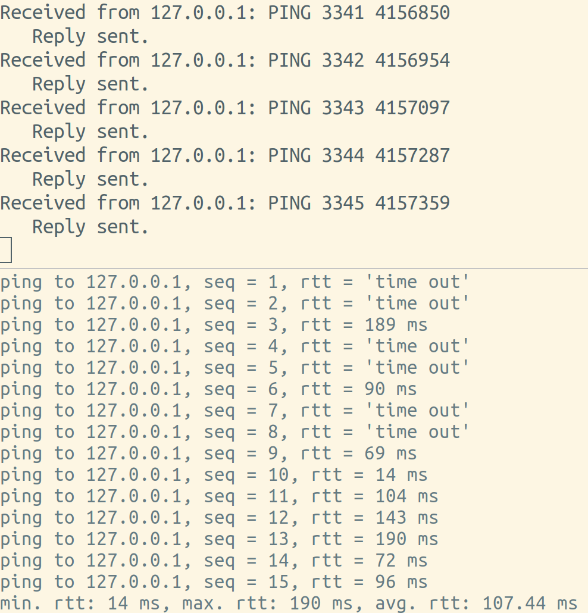

# Lab 02 - Ryan McClue (z5346008)

## 1. Wireshark HTTP GET Request/Response

1. *What is the status code and phrase returned from the server to the client browser?*

Status Code: 200 

Status Phrase: OK 

2.1 *When was the HTML file that the browser is retrieving last modified at the server?*

Tue, 23 Sep 2003, 5:29:00 GMT

2.2 *Does the response also contain a DATE header?*

Yes. It's Tue, 23 Sep 2003, 5:29:50 GMT

2.3 *How are these two fields different?*

The `Date` header is the time when the server sent the response message.
The `Last-Modified` header is the time when the server believes the resource requested was last changed.

3.1 *Is the connection established between the browser and the server persistent or non-persistent?*

Persistent.

3.2 *How can you infer this?*

HTTP1.1 is being used, which introduced persistent connection capabilities.
Furthermore, the presence of the header field `Connection: Keep-Alive` in the HTTP request/response
indicates that a single TCP connection can be used for multiple requests/responses.

4.1 *How many bytes of content are being returned to the browser?*

73

5.1 *What is the data contained inside the HTTP response packet?*


A html file containing: 
```
<html>
Congratulations.  You've downloaded the file lab2-1.html!
</html>
```

## 2. Wireshark HTTP Conditional GET Request/Response
1. *Do you see an “IF-MODIFIED-SINCE” line in the HTTP GET?*


No

2. *Does the response indicate the last time that the requested file was modified?*


Yes.  

3.1 *Do you see an “IF-MODIFIED-SINCE:” and “IF-NONE-MATCH” lines in the HTTP GET?* 


Yes

3.2 *If so, what information is contained in these header lines?*


If-Modified-Since: Tue, 23 Sep 2003 05:35:00 GMT

If-None-Match: "1bfef-173-8f4ae900"

4.1 *What is the HTTP status code and phrase returned from the server in response to this second HTTP GET?*


Status Code: 304 

Status Phrase: Not Modified

4.2 *Did the server explicitly return the contents of the file? Explain.*

No. The webserver determined that the file requested was already present in the client's browser cache and therefore did not need to return the file contents.

5.1 *What is the value of the Etag field in the 2nd response message and how it is used?*

`ETag: "1bfef-173-8f4ae900"`. It's used to determine if the content of a requested resource has changed on the server side and needs to be sent back to the client.
Furthermore, it's used in conjunction with the timestamp given by `If-Modified-Since` to implement conditional GET requests.

5.2 *Has this value changed since the 1st response message was received?*

No

## 3. PingClient

