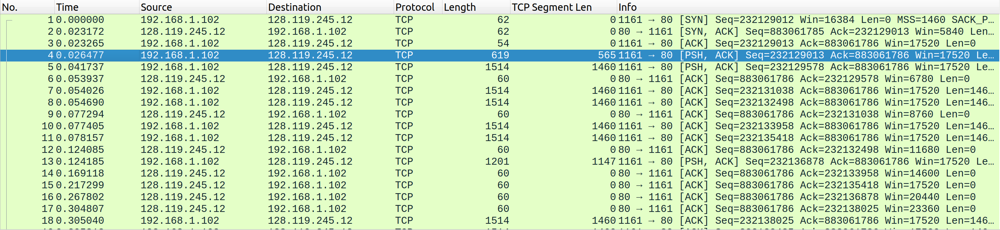
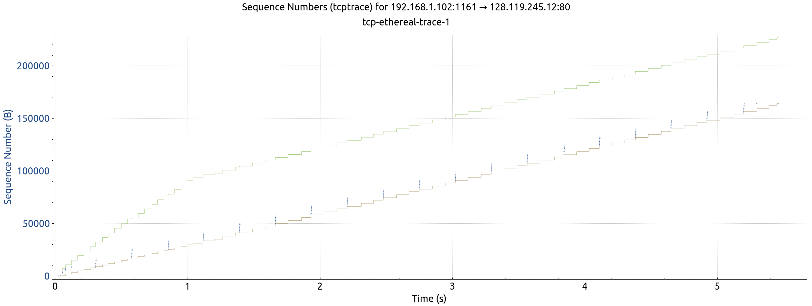
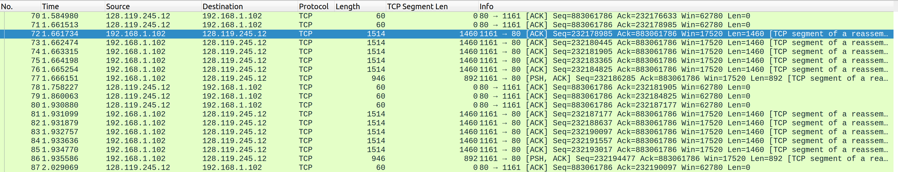

# Lab 04 - Ryan McClue (z5346008)

## 1. Understanding TCP using Wireshark
1. *What is the IP address of gaia.cs.umass.edu?*
`128.119.245.12`

*On what port number is it sending and receiving TCP segments for this connection?*
`80`

*What are the IP address and TCP port numbers used by the client computer (source) that is transferring the file to gaia.cs.umass.edu?*
`192.168.1.102, 1161`

2. *What is the sequence number of the TCP segment containing the HTTP POST command?*
`232129013`

3. *Consider the TCP segment containing the HTTP POST as the first segment in the TCP connection.
What are the sequence numbers of the first six segments in the TCP connection (including the segment containing the HTTP POST) sent from the client to the webserver*
*At what time was each segment sent?*

1: seq: `232129013`, time-sent: `0.026477`, ack-time-recieved: `0.053937` , sample-rtt: `0.027460` , estimated-rtt: ``
2: seq: `232129578`, time-sent: `0.041737`, ack-time-recieved: `0.077294` , sample-rtt: `0.035557` , estimated-rtt: ``
3: seq: `232131038`, time-sent: `0.054026`, ack-time-recieved: `0.124085` , sample-rtt: `0.070059` , estimated-rtt: ``
4: seq: `232132498`, time-sent: `0.054690`, ack-time-recieved: `0.169118` , sample-rtt: `0.114428` , estimated-rtt: ``
5: seq: `232133958`, time-sent: `0.077405`, ack-time-recieved: `0.217299` , sample-rtt: `0.139894` , estimated-rtt: ``
6: seq: `232135418`, time-sent: `0.078157`, ack-time-recieved: `0.267802` , sample-rtt: `0.189645` , estimated-rtt: ``

> sampleRTT is the RTT calculated from first packet and corresponding

What is the EstimatedRTT value after the receipt of each ACK? 
Assume that the initial value of EstimatedRTT is equal to the measured RTT 
(SampleRTT) for the first segment, 
and then is computed using the EstimatedRTT equation for all subsequent segments. 
Set alpha to 0.125
4. *What is the length of each of the first six TCP segments?*
1: `565` 
2: `1460`
3: `1460`
4: `1460`
5: `1460`
6: `1460`

5. *What is the minimum amount of available buffer space advertised at the receiver for the entire trace?*

Observing initial window size of first packet from server, see `5480` bytes 

*Does the lack of receiver buffer space ever throttle the sender?*
No. Inspecting the window size of sequential packets from the server, we see it's always
increasing. Therefore no throttling

6. *Are there any retransmitted segments in the trace file?*

Wireshark menu navigation: `Statistics -> TCP Stream Graphs -> Time Sequence`
There are no duplicated sequence numbers, so no retransmission

7. *How much data does the receiver typically acknowledge in an ACK?* 
1460
*Can you identify cases where the receiver is ACKing every other received segment:*

From packet 72-77 observe sending 6 packets.
However, only recieve 3 distinct ACKs (packets 78-80)
This is an example of cumulutive ACKs as a result of employing a delayed ACK protocol

8. *What is the throughput (bytes transferred per unit time) for the TCP connection?*
*Explain how you calculated this value.*

Packet 202 last from server to client. Subtract the first packet's SEQ number: `232129012` from this packet's ACK number: `232293103`.
Divide by total time, which is the time of packet 202 being recieved.
This gives `(232293103 - 232129012) / 5.455830` a throughput of approximately 30076 bytes per unit time

## 2. TCP Connection Management
1. *What is the sequence number of the TCP SYN segment that is used to initiate the TCP 
connection between the client computer and server?*

2. What is the sequence number of the SYNACK segment sent by the server to the client computer in reply to the SYN? What is the value of the Acknowledgement field in the SYNACK segment? How did the server determine that value?

3. What is the sequence number of the ACK segment sent by the client computer in response to the SYNACK? What is the value of the Acknowledgment field in this ACK segment? Does this segment contain any data?

4. Who has done the active close? client or the server? how you have determined this? What type of closure has been performed? 3 Segment (FIN/FINACK/ACK), 4 Segment (FIN/ACK/FIN/ACK) or Simultaneous close?

5. How many data bytes have been transferred from the client to the server and from the server to the client during the whole duration of the connection? What relationship does this have with the Initial Sequence Number and the final ACK received from the other side? 

1. 
4. simultaneous close as recieve 2 FIN packets consecutively 
5. may have to subtract 1 for SYN and 1 for FIN from byte 'data' calculation
