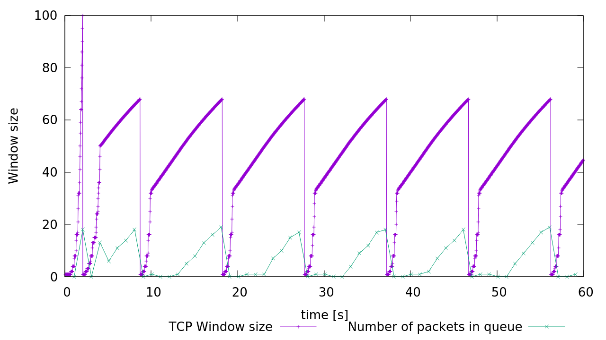
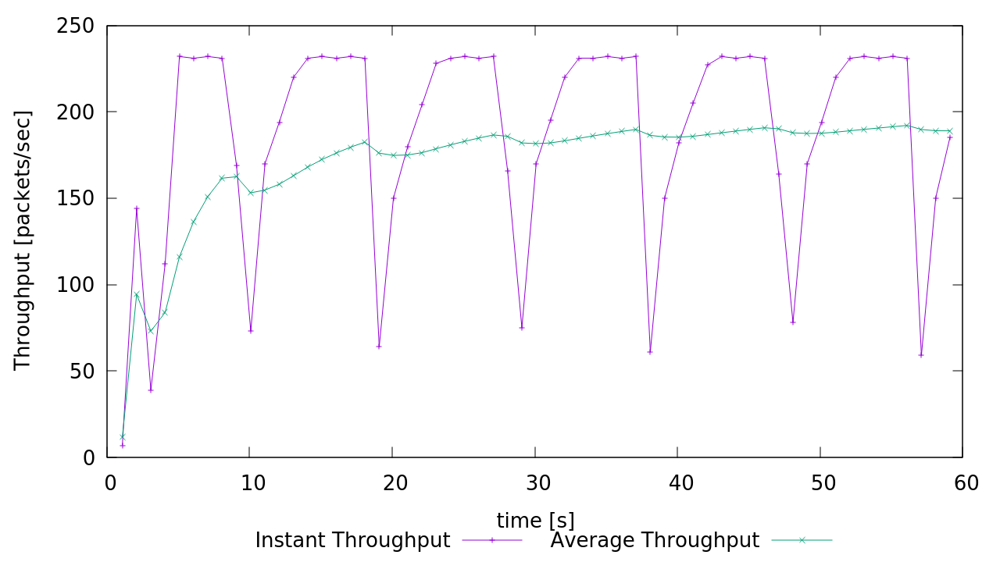
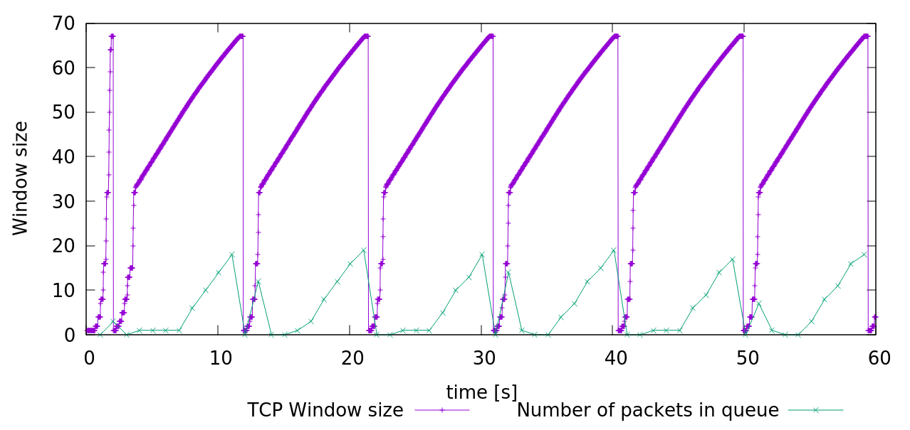
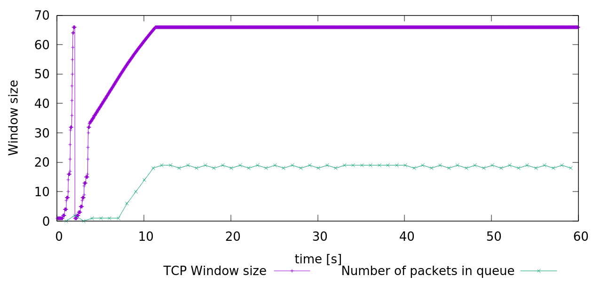
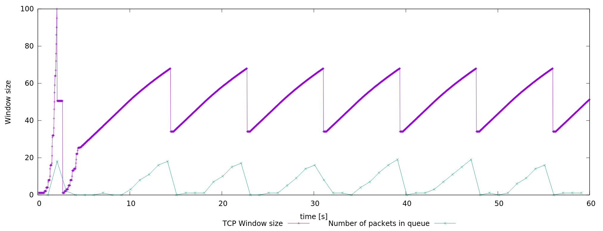
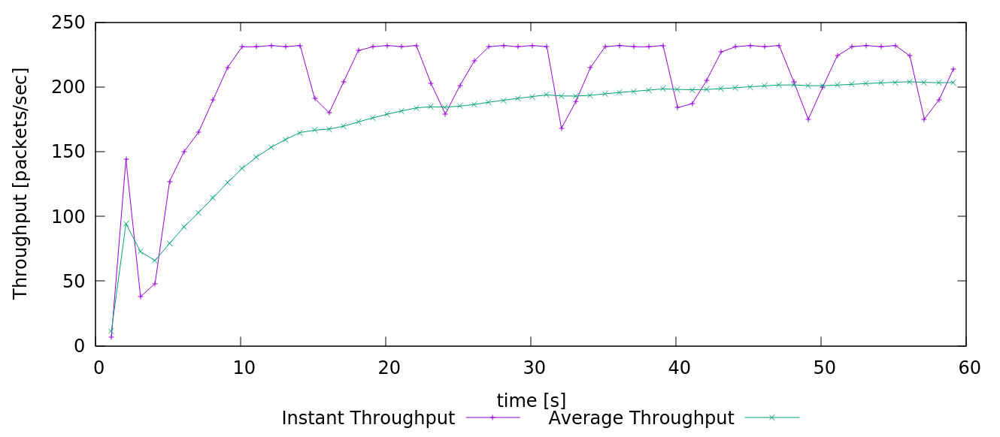
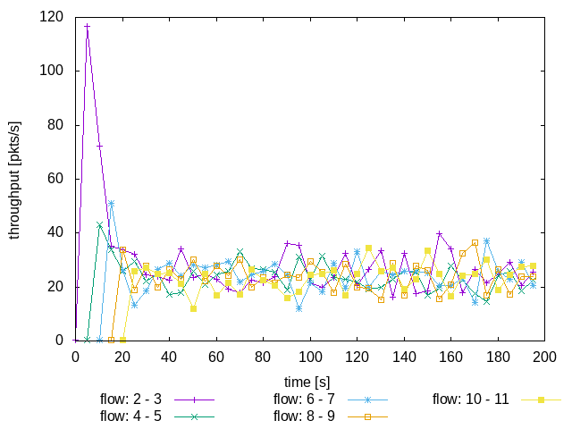
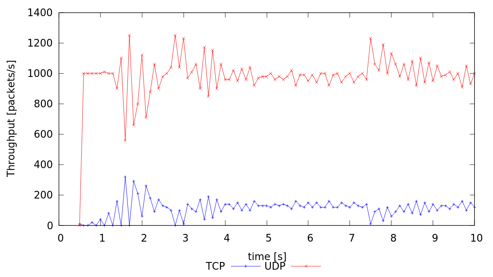

# Lab 05 - Ryan McClue (z5346008)

## 1. Understanding TCP Congestion Control using ns-2

1. *What is the maximum size of the congestion window that the TCP flow reaches in this case?* 

100

*What does the TCP flow do when the congestion window reaches this value? Why?*

Window size is reset to 1. Slow start threshold is divided by 2. 
All this occurs as a result of a loss event.

*What happens next?*

Slow start phase restarts.

2.  *What is the average throughput of TCP in this case? (both in number of packets per second and bps)*

190 packets/sec

`540 * 8 * 190 = 820800bps`

3. 
*Rerun the above script, each time with different values for the max congestion window size 
but the same RTT (i.e. 100ms).*

*How does TCP respond to the variation of this parameter?*

The amount of resources allocated for sending and recieving buffer sizes are changed.
Average window size may oscillate to varying extents based on network conditions.
Therefore, throughput will be affected also.

*Find the value of the maximum congestion window at which TCP stops oscillating 
(i.e., does not move up and down again) to reach a stable behaviour.*

Window size of 66 is optimal

*What is the average throughput (in packets and bps) at this point?*

212 packets/sec

`540 * 8 * 212 = 915840bps`

*How does the actual average throughput compare to the link capacity (1Mbps)?*

0.915Mbps, so less than link capacity.
However, as time continues, expect to approach link capacity as window size is at maximum optimal value.
Will never be exactly link capacity due to slow-start congestion control.

4. *Repeat the steps outlined in Questions 1 and 2 (NOT Question 3) but for TCP Reno.*

*What is the maximum size of the congestion window that the TCP flow reaches in this case?*

100

*What does the TCP flow do when the congestion window reaches this value? Why?*

Window size is divided by 2. Slow start threshold is divided by 2. 
All this occurs as a result of a loss event.

*What happens next?*

Additive phase continues.

*What is the average throughput of TCP in this case? (both in number of packets per second and bps)*

200 packets/sec

`540 * 8 * 200 = 864000bps`

*Compare the graphs for the two implementations and explain the differences.
(Hint: compare the number of times the congestion window goes back to zero in each case). 
How does the average throughput differ in both implementations?*

TCP Tahoe window size goes to 1 more times than TCP Reno. This is because TCP Tahoe reduces window size to 1 as a result of any loss event.
Comparatively, TCP Reno only reduces window size to 1 on a timeout and halves window size on a triple duplicate ACK. 
As we see no timeout loss event, we also observe the average throughput of TCP Reno to be higher than that of TCP Tahoe.

## 2. Flow Fairness with TCP
1. *Does each flow get an equal share of the capacity of the common link (i.e., is TCP fair)?* 

Yes

*Explain which observations lead you to this conclusion.*

After all TCP flows are initiated, we see that the throughput of each is roughly the same (approximately 20 packets/sec) as time progesses.

2. *What happens to the throughput of the pre-existing TCP flows when a new flow is created?* 

They decrease

*Explain the mechanisms of TCP which contribute to this behaviour.* 

TCP flow control ensures that ...

*Argue about whether you consider this behaviour to be fair or unfair.*

It's fair working under the directive that all connections are equal. 

## 3. TCP competing with UDP
1.
*How do you expect the TCP flow and the UDP flow to behave if the capacity of the link is 5 Mbps?*

UDP flow throughput will be much higher than TCP flow

2.
*Why does one flow achieve higher throughput than the other?* 

UDP will send as fast as the link capacity can support.
TCP employs congestion control. 
Window size changes based on AIMD will result in average TCP throughput to be much less than link capacity

*Try to explain what mechanisms force the two flows to stabilise to the observed throughput*
UDP stabilises due to link capacity bandwidth (will try and send as fast as the link provides) 
TCP stabilises due to congestion control

3.
*List the advantages and the disadvantages of using UDP instead of TCP for a file transfer, when our connection has to compete with other flows for the same link.* 

**Advantages**: Much higher throughput 
**Disadvantages**: Packet loss/reordering possible

*What would happen if everybody started using UDP instead of TCP for that same reason?*
Congestion would increase at user's links and router's links. This would increase time and networks go down 
