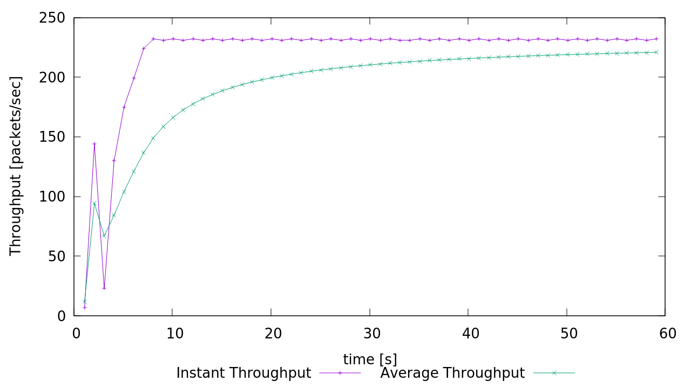

# Lab 05 - Ryan McClue (z5346008)

// TODO(Ryan): Seems we can just do a file copy under the hood

## 1. Understanding TCP Congestion Control using ns-2

script how sending window size changes
150 packet window size, how many packets sent in one run

1. *What is the maximum size of the congestion window that the TCP flow reaches in this case?* 

100

*What does the TCP flow do when the congestion window reaches this value? Why?*
Window size is reset to 1. Slow start threshold is divided by 2. 
All this occurs as a result of a timeout event.

*What happens next?*
Slow start phase restarts.

2.  *What is the average throughput of TCP in this case? 
(both in number of packets per second and bps)*

190 packets/sec
`540 * 8 * 190 = 820800bps`

3. 
Rerun the above script, each time with different values for the max congestion window size 
but the same RTT (i.e. 100ms). 
*How does TCP respond to the variation of this parameter?*
The amount of resources allocated for sending buffer size is changed.
Average window size may oscillate or become stable.
Therefore, throughput will be affected also.

*Find the value of the maximum congestion window at which TCP stops oscillating 
(i.e., does not move up and down again) to reach a stable behaviour.*

Window size of 66 is optimal

*What is the average throughput (in packets and bps) at this point?*

212 packets/sec
`540 * 8 * 212 = 915840bps`

*How does the actual average throughput compare to the link capacity (1Mbps)?*
0.915Mbps, so less than link capacity.
However, as time continues, expect to approach link capacity as window size is at maximum optimal value.
Will never be exactly link capacity due to slow-start congestion control.

4.

## 2. Flow Fairness with TCP
1.
connection fair, if all tcp connections equally share common link
yes roughly equal. the graph shows a degree of stability throughput around 20

2. 
throughput decrease as have to share

## 3. TCP competing with UDP
1.
*How do you expect the TCP flow and the UDP flow to behave if the capacity of the link is 5 Mbps?*
UDP flow will be much higher than TCP flow

2.
*Why does one flow achieve higher throughput than the other?* 

*Try to explain what mechanisms force the two flows to stabilise to the observed throughput*
UDP stabilises due to link capacity bandwidth (will try and send as fast as the link provides) 
TCP stabilises due to congestion control

3.2 
UDP can send as fast as it can (no congestion control).
also no changing window size

3.2
UDP much faster as no connection
UDP could get file loss
If everyone starting use UDP, congestion increase, networks go down
