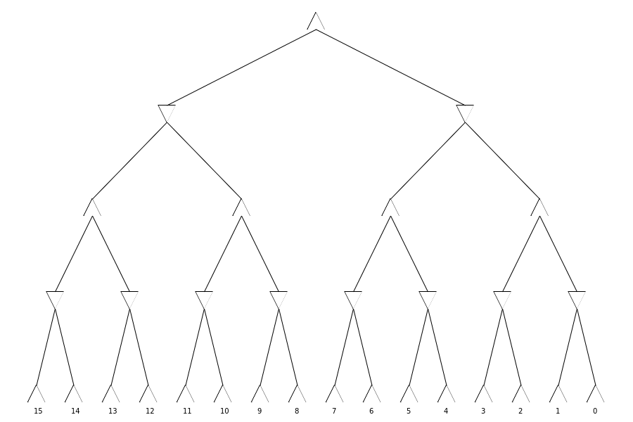
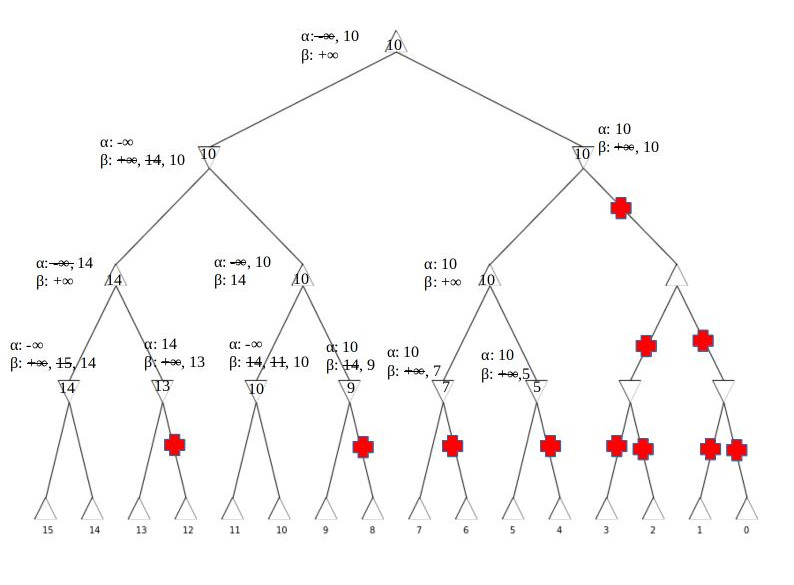

<!-- SPDX-License-Identifier: zlib-acknowledgement -->
1a.
| Start State | BFS      | IDS       | Greedy  | A\*   |
|-------------|----------|-----------|---------|-------|
| *start1*    |12, 10978 |12, 25121  |12, 59182|12, 30 |
| *start2*    |17, 344890|17, 349380 |17, 19   |17, 35 |
| *start3*    |18, 641252|18, 1209934|22, 59196|18, 133|

#python3 search.py --start "2634-5178-AB0C-9DEF" --s "bfs"
# [bfs] Generated: 23415. Expanded: 10978. Length: 12. Cost: 12.
#python3 search.py --start "2634-5178-AB0C-9DEF" --s "dfs" --id
# [dfs,id] Generated: 53489. Expanded: 25121. Length: 12. Cost: 12.
#python3 search.py --start "2634-5178-AB0C-9DEF" --s "greedy"
# [greedy] Generated: 127276. Expanded: 59182. Length: 12. Cost: 12.
#python3 search.py --start "2634-5178-AB0C-9DEF" --s "astar"
# [astar] Generated: 60. Expanded: 30. Length: 12. Cost: 12.


#python3 search.py --start "1034-728B-5D6A-E9FC" --s "bfs"
# [bfs] Generated: 734381. Expanded: 344890. Length: 17. Cost: 17.
#python3 search.py --start "1034-728B-5D6A-E9FC" --s "dfs" --id
# [dfs,id] Generated: 743882. Expanded: 349380. Length: 17. Cost: 17.
#python3 search.py --start "1034-728B-5D6A-E9FC" --s "greedy"
# [greedy] Generated: 44. Expanded: 19. Length: 17. Cost: 17.
#python3 search.py --start "1034-728B-5D6A-E9FC" --s "astar"
# [astar] Generated: 80. Expanded: 35. Length: 17. Cost: 17


#python3 search.py --start "5247-61C0-9A83-DEBF" --s "bfs"
# [bfs] Generated: 1365538. Expanded: 641252. Length: 18. Cost: 18.
#python3 search.py --start "5247-61C0-9A83-DEBF" --s "dfs" --id
# [dfs,id] Generated: 2576823. Expanded: 1209934. Length: 18. Cost: 18.
#python3 search.py --start "5247-61C0-9A83-DEBF" --s "greedy"
# [greedy] Generated: 126774. Expanded: 59196. Length: 22. Cost: 22. 
#python3 search.py --start "5247-61C0-9A83-DEBF" --s "astar"
# [astar] Generated: 270. Expanded: 133. Length: 18. Cost: 18.

1b.
BFS is optimal when there are no weights, as is this case here.
Therefore, the length found will always be the smallest possible.
It's an uninformed search, which causes it to expand more nodes than necessary.
This can be seen comparing its number of expanded nodes with that of A\*.
It has exponential space complexity.

IDS is optimal and uninformed like BFS. 
However, as it's a repeated DFS search, it will always expand more nodes than BFS.
This can be seen in comparing the expanded node count between IDS and BFS.
It has more efficient linear space complexity compared to BFS.

Greedy is suboptimal, meaning the length found may not always be the smallest possible.
This can be seen in start state 3.
It's an informed search, with a heuristic estimating the cost to the goal. 
So, it makes decisions in isolation, i.e. no thinking about past decisions.
As a result, it can potentially expand more nodes than an uninformed search as seen in start state 1.
Or, it could possibly expand less nodes as seen in start state 2.

A\* is an informed search.
It uses a function that combines the cost of reaching the next node and a heuristic estimating cost to goal.
If this heuristic is admissable, i.e. doesn't overestimate cost, it's optimal.
In most cases, A\* will expand the fewest nodes, as its guided by the most information.

2a.
For `w=0`:
```
f(n) = (2 - 0)·g(n) + 0·h(n) 
     = 2·g(n)
```
Scaling `g(n)` by a constant factor has no effect on ordering of paths.
Therefore optimal.
For `w=1`:
```
f(n) = (2 - 1)·g(n) + 1·h(n) 
     = g(n) + h(n)
```
As `h(n)` is admissable, know that this is optimal.
Therefore, optimal for `0 <= w <= 1`

2b.
|             |*start4* | *start5* | *start6*   |
|-------------|---------|----------|------------|
| IDA\* Search|45,545120|50,4178819|56,169367641|
| HPS, w=1.1  |47,523052|54,857155 |58,13770561 |
| HPS, w=1.2  |47,29761 |56,64522  |60,265672   |
| HPS, w=1.3  |55,968   |62,5781   |68,9066     |
| HPS, w=1.4  |65,9876  |70,561430 |80,37869    |

# python3 search.py --start "A974-3256-FD8B-EC01" --s "heuristic" --w 1.1 --id
# [w= 1.1,id] Generated: 1069431. Expanded: 523052. Length: 47. Cost: 47.
# python3 search.py --start "A974-3256-FD8B-EC01" --s "heuristic" --w 1.2 --id
# [w= 1.2,id] Generated: 61675. Expanded: 29761. Length: 47. Cost: 47.
# python3 search.py --start "A974-3256-FD8B-EC01" --s "heuristic" --w 1.3 --id
# [w= 1.3,id] Generated: 2002. Expanded: 968. Length: 55. Cost: 55.
# python3 search.py --start "A974-3256-FD8B-EC01" --s "heuristic" --w 1.4 --id
# [w= 1.4,id] Generated: 20791. Expanded: 9876. Length: 65. Cost: 65.

# python3 search.py --start "153E-A02C-9FBD-8476" --s "heuristic" --w 1.1 --id
# [w= 1.1,id] Generated: 1727687. Expanded: 857155. Length: 54. Cost: 54.
# python3 search.py --start "153E-A02C-9FBD-8476" --s "heuristic" --w 1.2 --id
# [w= 1.2,id] Generated: 130866. Expanded: 64522. Length: 56. Cost: 56.
# python3 search.py --start "153E-A02C-9FBD-8476" --s "heuristic" --w 1.3 --id
# [w= 1.3,id] Generated: 11871. Expanded: 5781. Length: 62. Cost: 62.
# python3 search.py --start "153E-A02C-9FBD-8476" --s "heuristic" --w 1.4 --id
# [w= 1.4,id] Generated: 1176653. Expanded: 561430. Length: 70. Cost: 70.

# python3 search.py --start "418E-7AD0-9C52-3FB6" --s "heuristic" --w 1.1 --id
# python3 search.py --start "418E-7AD0-9C52-3FB6" --s "heuristic" --w 1.2 --id
# [w= 1.2,id] Generated: 537049. Expanded: 265672. Length: 60. Cost: 60.
# python3 search.py --start "418E-7AD0-9C52-3FB6" --s "heuristic" --w 1.3 --id
# [w= 1.3,id] Generated: 18791. Expanded: 9066. Length: 68. Cost: 68.
# python3 search.py --start "418E-7AD0-9C52-3FB6" --s "heuristic" --w 1.4 --id
# [w= 1.4,id] Generated: 80627. Expanded: 37869. Length: 80. Cost: 80. 
2c.
For optimality, `h(n)` must not overestimate, i.e. be admissable.
`w=1` equates to IDA\* search, which uses admissable heuristic.
Therefore, it is optimal and returns the smallest path length.
As values of `w` increase, the greater extent `h(n)` overestimates.
Therefore, as `w` increases, optimality is reduced.
This can be seen for successive values of `w` returning larger path lengths.

Larger values of `w` make the function more greedy.
By making a function more greedy, we are most likely reducing the size of the decision space.
This equates to expanding less nodes.
For this particular problem, a certain level of greediness will reduce number of expanded nodes.
This is seen for searches up to `w=1.3`.
For `w=1.4`, number of expanded nodes begins to increase.
In general, greedy is more memory friendly, but less optimal.


3a.
M(1) = [+,-] = 2 (s=1)
M(2) = [+,o,-] = 3 (s=1)
M(3) = [+,o,o,-] = 4 (s=1)
M(4) = [+,+,-,-] = 4 (s=2)
M(5) = [+,+,-,o,-] = 5 (s=2)
M(6) = [+,+,o,-,-] = 5 (s=2)
M(7) = [+,+,o,-,o,-] = 6 (s=2)
M(8) = [+,+,o,o,-,-] = 6 (s=2)
M(9) = [+,+,+,-,-,-] = 6 (s=3)
M(10) = [+,+,+,-,-,o,-] = 7 (s=3)
M(11) = [+,+,+,-,o,-,-] = 7 (s=3)
M(12) = [+,+,+,o,-,-,-] = 7 (s=3)
M(13) = [+,+,+,o,-,-,o,-] = 8 (s=3)
M(14) = [+,+,+,o,-,o,-,-] = 8 (s=3)
M(15) = [+,+,+,o,o,-,-,-] = 8 (s=3)
M(16) = [+,+,+,+,-,-,-,-] = 8 (s=4)
M(17) = [+,+,+,+,-,-,-,o,-] = 9 (s=4)
M(18) = [+,+,+,+,-,-,o,-,-] = 9 (s=4)
M(19) = [+,+,+,+,-,o,-,-,-] = 9 (s=4)
M(20) = [+,+,+,+,o,-,-,-,-] = 9 (s=4)
M(21) = [+,+,+,+,o,-,-,o,-] = 9 (s=4)

3b.
`s = s + 1` and `M = M + 2` every time n is perfect square.


4a.

4b.

4c.

4d.
Time complexity is
