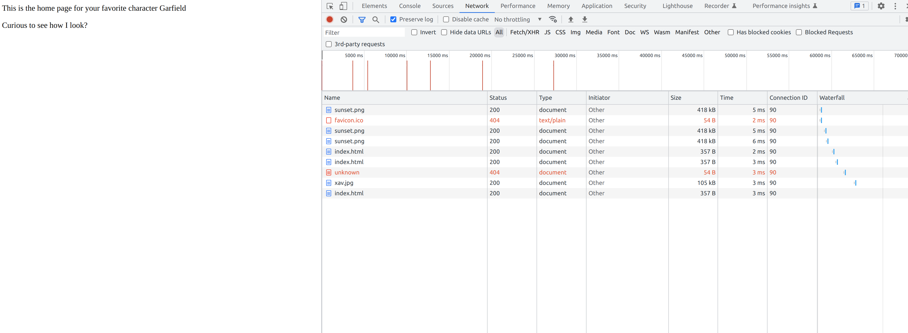

# Lab 03 - Ryan McClue (z5346008)

## 1. Digging into DNS 

1. *What is the IP address of www.eecs.berkeley.edu . What type of DNS query is sent to get this answer?*
```
 <<>> DiG 9.16.33-Debian <<>> www.eecs.berkeley.edu A
;; global options: +cmd
;; Got answer:
;; ->>HEADER<<- opcode: QUERY, status: NOERROR, id: 50595
;; flags: qr rd ra; QUERY: 1, ANSWER: 3, AUTHORITY: 4, ADDITIONAL: 7

;; OPT PSEUDOSECTION:
; EDNS: version: 0, flags:; udp: 4096
;; QUESTION SECTION:
;www.eecs.berkeley.edu.		IN	A

;; ANSWER SECTION:
www.eecs.berkeley.edu.	9152	IN	CNAME	live-eecs.pantheonsite.io.
live-eecs.pantheonsite.io. 600	IN	CNAME	fe1.edge.pantheon.io.
fe1.edge.pantheon.io.	300	IN	A	23.185.0.1

;; AUTHORITY SECTION:
edge.pantheon.io.	300	IN	NS	ns-2013.awsdns-59.co.uk.
edge.pantheon.io.	300	IN	NS	ns-233.awsdns-29.com.
edge.pantheon.io.	300	IN	NS	ns-1213.awsdns-23.org.
edge.pantheon.io.	300	IN	NS	ns-644.awsdns-16.net.

;; ADDITIONAL SECTION:
ns-233.awsdns-29.com.	39481	IN	A	205.251.192.233
ns-644.awsdns-16.net.	58477	IN	A	205.251.194.132
ns-1213.awsdns-23.org.	10158	IN	A	205.251.196.189
ns-1213.awsdns-23.org.	4566	IN	AAAA	2600:9000:5304:bd00::1
ns-2013.awsdns-59.co.uk. 100701	IN	A	205.251.199.221
ns-2013.awsdns-59.co.uk. 6507	IN	AAAA	2600:9000:5307:dd00::1

;; Query time: 20 msec
;; SERVER: 129.94.242.2#53(129.94.242.2)
;; WHEN: Thu Oct 06 12:59:34 AEDT 2022
;; MSG SIZE  rcvd: 397
```

IP address: `23.185.0.1`, DNS type A query

2. *What is the canonical name for the eecs.berkeley webserver (i.e. www.eecs.berkeley.edu )? Suggest a reason for having an alias for this server.*

`live-eecs.pantheonsite.io.`
The canonical name is for developers to more easily identify position in internal network.
The alias is therefore a more user friendly name of the canonical name for use by the public.

3. *What can you make of the rest of the response (i.e. the details available in the Authority and Additional sections)?*

The Authority section lists domain name servers while the Additional section contains the IP addresses of the aforementioned name servers

4. What is the IP address of the local nameserver for your machine?

`129.94.242.2`

5. *What are the DNS nameservers for the "eecs.berkeley.edu." Find out their IP addresses? What type of DNS query is sent to obtain this information?*
```
; <<>> DiG 9.16.33-Debian <<>> eecs.berkeley.edu NS
;; global options: +cmd
;; Got answer:
;; ->>HEADER<<- opcode: QUERY, status: NOERROR, id: 39753
;; flags: qr rd ra; QUERY: 1, ANSWER: 5, AUTHORITY: 0, ADDITIONAL: 5

;; OPT PSEUDOSECTION:
; EDNS: version: 0, flags:; udp: 4096
;; QUESTION SECTION:
;eecs.berkeley.edu.		IN	NS

;; ANSWER SECTION:
eecs.berkeley.edu.	2602	IN	NS	adns2.berkeley.edu.
eecs.berkeley.edu.	2602	IN	NS	ns.CS.berkeley.edu.
eecs.berkeley.edu.	2602	IN	NS	adns3.berkeley.edu.
eecs.berkeley.edu.	2602	IN	NS	ns.eecs.berkeley.edu.
eecs.berkeley.edu.	2602	IN	NS	adns1.berkeley.edu.

;; ADDITIONAL SECTION:
ns.CS.berkeley.edu.	38031	IN	A	169.229.60.61
ns.CS.berkeley.edu.	7914	IN	AAAA	2607:f140:8:1260::30
ns.eecs.berkeley.edu.	38031	IN	A	169.229.60.153
ns.eecs.berkeley.edu.	28275	IN	AAAA	2607:f140:8:2160::30

;; Query time: 0 msec
;; SERVER: 129.94.242.2#53(129.94.242.2)
;; WHEN: Thu Oct 06 13:08:33 AEDT 2022
;; MSG SIZE  rcvd: 231
```

DNS nameservers are `adns2.berkeley.edu.`, `ns.CS.berkeley.edu.`, `adns3.berkeley.edu.`, `ns.eecs.berkeley.edu.`, `eadns1.berkeley.edu.` 
IP addresses are `169.229.60.61` and `169.229.60.153` 

6. *What is the DNS name associated with the IP address 111.68.101.54? What type of DNS query is sent to obtain this information?*

```
; <<>> DiG 9.16.33-Debian <<>> -x 111.68.101.54
;; global options: +cmd
;; Got answer:
;; ->>HEADER<<- opcode: QUERY, status: NOERROR, id: 43381
;; flags: qr rd ra; QUERY: 1, ANSWER: 1, AUTHORITY: 2, ADDITIONAL: 3

;; OPT PSEUDOSECTION:
; EDNS: version: 0, flags:; udp: 4096
;; QUESTION SECTION:
;54.101.68.111.in-addr.arpa.	IN	PTR

;; ANSWER SECTION:
54.101.68.111.in-addr.arpa. 2596 IN	PTR	webserver.seecs.nust.edu.pk.

;; AUTHORITY SECTION:
101.68.111.in-addr.arpa. 4954	IN	NS	ns1.hec.gov.pk.
101.68.111.in-addr.arpa. 4954	IN	NS	ns2.hec.gov.pk.

;; ADDITIONAL SECTION:
ns1.hec.gov.pk.		2596	IN	A	103.4.93.5
ns2.hec.gov.pk.		2596	IN	A	103.4.93.6

;; Query time: 0 msec
;; SERVER: 129.94.242.2#53(129.94.242.2)
;; WHEN: Thu Oct 06 13:12:40 AEDT 2022
;; MSG SIZE  rcvd: 172
```

DNS name is `webserver.seecs.nust.edu.pk.`, obtained from PTR DNS query.

7. *Run dig and query the CSE nameserver (129.94.242.33) for the mail servers for Yahoo!. Did you get an authoritative answer? Why?*
```
; <<>> DiG 9.16.33-Debian <<>> @129.94.242.33 yahoo.com MX
; (1 server found)
;; global options: +cmd
;; Got answer:
;; ->>HEADER<<- opcode: QUERY, status: NOERROR, id: 1346
;; flags: qr rd ra; QUERY: 1, ANSWER: 3, AUTHORITY: 5, ADDITIONAL: 10

;; OPT PSEUDOSECTION:
; EDNS: version: 0, flags:; udp: 4096
;; QUESTION SECTION:
;yahoo.com.			IN	MX

;; ANSWER SECTION:
yahoo.com.		1800	IN	MX	1 mta6.am0.yahoodns.net.
yahoo.com.		1800	IN	MX	1 mta5.am0.yahoodns.net.
yahoo.com.		1800	IN	MX	1 mta7.am0.yahoodns.net.

;; AUTHORITY SECTION:
yahoo.com.		19941	IN	NS	ns3.yahoo.com.
yahoo.com.		19941	IN	NS	ns4.yahoo.com.
yahoo.com.		19941	IN	NS	ns2.yahoo.com.
yahoo.com.		19941	IN	NS	ns5.yahoo.com.
yahoo.com.		19941	IN	NS	ns1.yahoo.com.

;; ADDITIONAL SECTION:
ns1.yahoo.com.		98977	IN	A	68.180.131.16
ns1.yahoo.com.		139742	IN	AAAA	2001:4998:1b0::7961:686f:6f21
ns2.yahoo.com.		138563	IN	A	68.142.255.16
ns2.yahoo.com.		43903	IN	AAAA	2001:4998:1c0::7961:686f:6f21
ns3.yahoo.com.		200	IN	A	27.123.42.42
ns3.yahoo.com.		200	IN	AAAA	2406:8600:f03f:1f8::1003
ns4.yahoo.com.		431945	IN	A	98.138.11.157
ns5.yahoo.com.		30790	IN	A	202.165.97.53
ns5.yahoo.com.		21222	IN	AAAA	2406:2000:1d0::7961:686f:6f21

;; Query time: 100 msec
;; SERVER: 129.94.242.33#53(129.94.242.33)
;; WHEN: Thu Oct 06 13:14:45 AEDT 2022
;; MSG SIZE  rcvd: 399
```

No authoratative response. This is indicated by the absence of the flag `aa`. 
Furthermore, as we are going through CSE name server and not Yahoo, it's impossible to get an authoratative response.

8. *Repeat the above (i.e. Question 7) but use one of the nameservers obtained in Question 5. What is the result?*
```
; <<>> DiG 9.16.33-Debian <<>> @169.229.60.61 yahoo.com MX
; (1 server found)
;; global options: +cmd
;; connection timed out; no servers could be reached
```

Connection timed out. This is most likely because berkeley have denied access to thier name servers from users external to their network

9. Obtain the authoritative answer for the mail servers for Yahoo! Mail. What type of DNS query is sent to obtain this information?
```
; <<>> DiG 9.16.33-Debian <<>> @68.180.131.16 yahoo.com MX
; (1 server found)
;; global options: +cmd
;; Got answer:
;; ->>HEADER<<- opcode: QUERY, status: NOERROR, id: 27965
;; flags: qr aa rd; QUERY: 1, ANSWER: 3, AUTHORITY: 0, ADDITIONAL: 1
;; WARNING: recursion requested but not available

;; OPT PSEUDOSECTION:
; EDNS: version: 0, flags:; udp: 1272
; COOKIE: 5025ded843cc081a212643ab633e3ac54ef8689467fc63e4 (good)
;; QUESTION SECTION:
;yahoo.com.			IN	MX

;; ANSWER SECTION:
yahoo.com.		1800	IN	MX	1 mta7.am0.yahoodns.net.
yahoo.com.		1800	IN	MX	1 mta6.am0.yahoodns.net.
yahoo.com.		1800	IN	MX	1 mta5.am0.yahoodns.net.

;; Query time: 144 msec
;; SERVER: 68.180.131.16#53(68.180.131.16)
;; WHEN: Thu Oct 06 13:17:41 AEDT 2022
;; MSG SIZE  rcvd: 145
```

Authoratative mail servers are `mta7.am0.yahoodns.net.`, `mta6.am0.yahoodns.net.` and `mta5.am0.yahoodns.net.`
Obtained with MX DNS query

10. *Iterative DNS Query to "vx04.orchestra.cse.unsw.EDU.AU". How many DNS servers do you have to query to get the authoritative answer?*

```
; <<>> DiG 9.16.33-Debian <<>> . NS
;; global options: +cmd
;; Got answer:
;; ->>HEADER<<- opcode: QUERY, status: NOERROR, id: 51530
;; flags: qr rd ra; QUERY: 1, ANSWER: 13, AUTHORITY: 0, ADDITIONAL: 27

;; OPT PSEUDOSECTION:
; EDNS: version: 0, flags:; udp: 4096
;; QUESTION SECTION:
;.				IN	NS

;; ANSWER SECTION:
.			165391	IN	NS	k.root-servers.net.
.			165391	IN	NS	i.root-servers.net.
.			165391	IN	NS	d.root-servers.net.
.			165391	IN	NS	m.root-servers.net.
.			165391	IN	NS	f.root-servers.net.
.			165391	IN	NS	b.root-servers.net.
.			165391	IN	NS	g.root-servers.net.
.			165391	IN	NS	a.root-servers.net.
.			165391	IN	NS	l.root-servers.net.
.			165391	IN	NS	c.root-servers.net.
.			165391	IN	NS	e.root-servers.net.
.			165391	IN	NS	j.root-servers.net.
.			165391	IN	NS	h.root-servers.net.

;; ADDITIONAL SECTION:
a.root-servers.net.	166423	IN	A	198.41.0.4
a.root-servers.net.	133350	IN	AAAA	2001:503:ba3e::2:30
b.root-servers.net.	359564	IN	A	199.9.14.201
b.root-servers.net.	107956	IN	AAAA	2001:500:200::b
c.root-servers.net.	273176	IN	A	192.33.4.12
c.root-servers.net.	29159	IN	AAAA	2001:500:2::c
d.root-servers.net.	273175	IN	A	199.7.91.13
d.root-servers.net.	29159	IN	AAAA	2001:500:2d::d
e.root-servers.net.	135890	IN	A	192.203.230.10
e.root-servers.net.	29159	IN	AAAA	2001:500:a8::e
f.root-servers.net.	12186	IN	A	192.5.5.241
f.root-servers.net.	29159	IN	AAAA	2001:500:2f::f
g.root-servers.net.	461168	IN	A	192.112.36.4
g.root-servers.net.	29159	IN	AAAA	2001:500:12::d0d
h.root-servers.net.	273176	IN	A	198.97.190.53
h.root-servers.net.	29159	IN	AAAA	2001:500:1::53
i.root-servers.net.	461168	IN	A	192.36.148.17
i.root-servers.net.	29159	IN	AAAA	2001:7fe::53
j.root-servers.net.	274673	IN	A	192.58.128.30
j.root-servers.net.	107956	IN	AAAA	2001:503:c27::2:30
k.root-servers.net.	273175	IN	A	193.0.14.129
k.root-servers.net.	29159	IN	AAAA	2001:7fd::1
l.root-servers.net.	165833	IN	A	199.7.83.42
l.root-servers.net.	107956	IN	AAAA	2001:500:9f::42
m.root-servers.net.	511834	IN	A	202.12.27.33
m.root-servers.net.	29159	IN	AAAA	2001:dc3::35

;; Query time: 0 msec
;; SERVER: 129.94.242.2#53(129.94.242.2)
;; WHEN: Thu Oct 06 13:20:15 AEDT 2022
;; MSG SIZE  rcvd: 811's
```

```
; <<>> DiG 9.16.33-Debian <<>> @198.41.0.4 vx04.orchestra.cse.unsw.EDU.AU
; (1 server found)
;; global options: +cmd
;; Got answer:
;; ->>HEADER<<- opcode: QUERY, status: NOERROR, id: 51755
;; flags: qr rd; QUERY: 1, ANSWER: 0, AUTHORITY: 8, ADDITIONAL: 17
;; WARNING: recursion requested but not available

;; OPT PSEUDOSECTION:
; EDNS: version: 0, flags:; udp: 4096
;; QUESTION SECTION:
;vx04.orchestra.cse.unsw.EDU.AU.	IN	A

;; AUTHORITY SECTION:
AU.			172800	IN	NS	d.AU.
AU.			172800	IN	NS	m.AU.
AU.			172800	IN	NS	q.AU.
AU.			172800	IN	NS	t.AU.
AU.			172800	IN	NS	s.AU.
AU.			172800	IN	NS	r.AU.
AU.			172800	IN	NS	n.AU.
AU.			172800	IN	NS	c.AU.

;; ADDITIONAL SECTION:
d.AU.			172800	IN	A	162.159.25.38
d.AU.			172800	IN	AAAA	2400:cb00:2049:1::a29f:1926
m.AU.			172800	IN	A	37.209.192.5
m.AU.			172800	IN	AAAA	2001:dcd:1::5
q.AU.			172800	IN	A	65.22.196.1
q.AU.			172800	IN	AAAA	2a01:8840:be::1
t.AU.			172800	IN	A	65.22.199.1
t.AU.			172800	IN	AAAA	2a01:8840:c1::1
s.AU.			172800	IN	A	65.22.198.1
s.AU.			172800	IN	AAAA	2a01:8840:c0::1
r.AU.			172800	IN	A	65.22.197.1
r.AU.			172800	IN	AAAA	2a01:8840:bf::1
n.AU.			172800	IN	A	37.209.194.5
n.AU.			172800	IN	AAAA	2001:dcd:2::5
c.AU.			172800	IN	A	162.159.24.179
c.AU.			172800	IN	AAAA	2400:cb00:2049:1::a29f:18b3

;; Query time: 140 msec
;; SERVER: 198.41.0.4#53(198.41.0.4)
;; WHEN: Thu Oct 06 13:21:41 AEDT 2022
;; MSG SIZE  rcvd: 539
```

```
; <<>> DiG 9.16.33-Debian <<>> @162.159.25.38 vx04.orchestra.cse.unsw.EDU.AU
; (1 server found)
;; global options: +cmd
;; Got answer:
;; ->>HEADER<<- opcode: QUERY, status: NOERROR, id: 38106
;; flags: qr rd; QUERY: 1, ANSWER: 0, AUTHORITY: 4, ADDITIONAL: 9
;; WARNING: recursion requested but not available

;; OPT PSEUDOSECTION:
; EDNS: version: 0, flags:; udp: 1232
;; QUESTION SECTION:
;vx04.orchestra.cse.unsw.EDU.AU.	IN	A

;; AUTHORITY SECTION:
EDU.AU.			900	IN	NS	s.AU.
EDU.AU.			900	IN	NS	t.AU.
EDU.AU.			900	IN	NS	r.AU.
EDU.AU.			900	IN	NS	q.AU.

;; ADDITIONAL SECTION:
q.AU.			900	IN	A	65.22.196.1
r.AU.			900	IN	A	65.22.197.1
s.AU.			900	IN	A	65.22.198.1
t.AU.			900	IN	A	65.22.199.1
q.AU.			900	IN	AAAA	2a01:8840:be::1
r.AU.			900	IN	AAAA	2a01:8840:bf::1
s.AU.			900	IN	AAAA	2a01:8840:c0::1
t.AU.			900	IN	AAAA	2a01:8840:c1::1

;; Query time: 4 msec
;; SERVER: 162.159.25.38#53(162.159.25.38)
;; WHEN: Thu Oct 06 13:22:34 AEDT 2022
;; MSG SIZE  rcvd: 299
```

```
; <<>> DiG 9.16.33-Debian <<>> @65.22.196.1 vx04.orchestra.cse.unsw.EDU.AU
; (1 server found)
;; global options: +cmd
;; Got answer:
;; ->>HEADER<<- opcode: QUERY, status: NOERROR, id: 19745
;; flags: qr rd; QUERY: 1, ANSWER: 0, AUTHORITY: 3, ADDITIONAL: 6
;; WARNING: recursion requested but not available

;; OPT PSEUDOSECTION:
; EDNS: version: 0, flags:; udp: 1232
;; QUESTION SECTION:
;vx04.orchestra.cse.unsw.EDU.AU.	IN	A

;; AUTHORITY SECTION:
unsw.edu.au.		900	IN	NS	ns2.unsw.edu.au.
unsw.edu.au.		900	IN	NS	ns3.unsw.edu.au.
unsw.edu.au.		900	IN	NS	ns1.unsw.edu.au.

;; ADDITIONAL SECTION:
ns1.unsw.edu.au.	900	IN	A	129.94.0.192
ns2.unsw.edu.au.	900	IN	A	129.94.0.193
ns3.unsw.edu.au.	900	IN	A	192.155.82.178
ns1.unsw.edu.au.	900	IN	AAAA	2001:388:c:35::1
ns2.unsw.edu.au.	900	IN	AAAA	2001:388:c:35::2

;; Query time: 24 msec
;; SERVER: 65.22.196.1#53(65.22.196.1)
;; WHEN: Thu Oct 06 13:23:43 AEDT 2022
;; MSG SIZE  rcvd: 228
```

```
; <<>> DiG 9.16.33-Debian <<>> @129.94.0.192 vx04.orchestra.cse.unsw.EDU.AU
; (1 server found)
;; global options: +cmd
;; Got answer:
;; ->>HEADER<<- opcode: QUERY, status: NOERROR, id: 27176
;; flags: qr rd; QUERY: 1, ANSWER: 0, AUTHORITY: 2, ADDITIONAL: 5
;; WARNING: recursion requested but not available

;; OPT PSEUDOSECTION:
; EDNS: version: 0, flags:; udp: 4096
;; QUESTION SECTION:
;vx04.orchestra.cse.unsw.EDU.AU.	IN	A

;; AUTHORITY SECTION:
cse.unsw.EDU.AU.	300	IN	NS	beethoven.orchestra.cse.unsw.EDU.AU.
cse.unsw.EDU.AU.	300	IN	NS	maestro.orchestra.cse.unsw.EDU.AU.

;; ADDITIONAL SECTION:
beethoven.orchestra.cse.unsw.EDU.AU. 300 IN A	129.94.172.11
beethoven.orchestra.cse.unsw.EDU.AU. 300 IN A	129.94.208.3
beethoven.orchestra.cse.unsw.EDU.AU. 300 IN A	129.94.242.2
maestro.orchestra.cse.unsw.EDU.AU. 300 IN A	129.94.242.33

;; Query time: 4 msec
;; SERVER: 129.94.0.192#53(129.94.0.192)
;; WHEN: Thu Oct 06 13:24:24 AEDT 2022
;; MSG SIZE  rcvd: 169
```

```
; <<>> DiG 9.16.33-Debian <<>> @129.94.172.11 vx04.orchestra.cse.unsw.EDU.AU
; (1 server found)
;; global options: +cmd
;; Got answer:
;; ->>HEADER<<- opcode: QUERY, status: NOERROR, id: 60990
;; flags: qr aa rd ra; QUERY: 1, ANSWER: 1, AUTHORITY: 2, ADDITIONAL: 3

;; OPT PSEUDOSECTION:
; EDNS: version: 0, flags:; udp: 4096
;; QUESTION SECTION:
;vx04.orchestra.cse.unsw.EDU.AU.	IN	A

;; ANSWER SECTION:
vx04.orchestra.cse.unsw.EDU.AU.	3600 IN	A	129.94.242.117

;; AUTHORITY SECTION:
orchestra.cse.unsw.EDU.AU. 3600	IN	NS	maestro.orchestra.cse.unsw.EDU.AU.
orchestra.cse.unsw.EDU.AU. 3600	IN	NS	beethoven.orchestra.cse.unsw.EDU.AU.

;; ADDITIONAL SECTION:
maestro.orchestra.cse.unsw.EDU.AU. 3600	IN A	129.94.242.33
beethoven.orchestra.cse.unsw.EDU.AU. 3600 IN A	129.94.242.2

;; Query time: 0 msec
;; SERVER: 129.94.172.11#53(129.94.172.11)
;; WHEN: Thu Oct 06 13:25:29 AEDT 2022
;; MSG SIZE  rcvd: 153
```

Had to query 6 DNS servers to get authoritative answer.

11. *Can one physical machine have several names and/or IP addresses associated with it?*

One physical machine can have different names, e.g. CNAME record.
Furthermore, one physical machine can have several IP addresses associated with it, e.g. router.

## 2. Webserver

